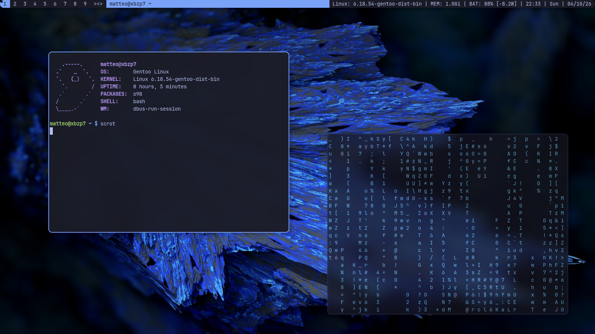

## Preview



Requirements
------------
In order to build dwm you need the Xlib header files.
- feh
- scrot
- xorg
- Jetbrains Nerd Font "see mst"
- st (mst [Vai alla sezione Installazione](https://github.com/Matteo7034/mst) ) 
- librewolf
- dmenu
- picom
- pipewire (systemd debian)
- slock 
- xss-lock

Installation
------------
```bash
cp ~/mdwml/scripts/.xinitrc ~/
cd ~/mdwml
sudo make clean install
```


